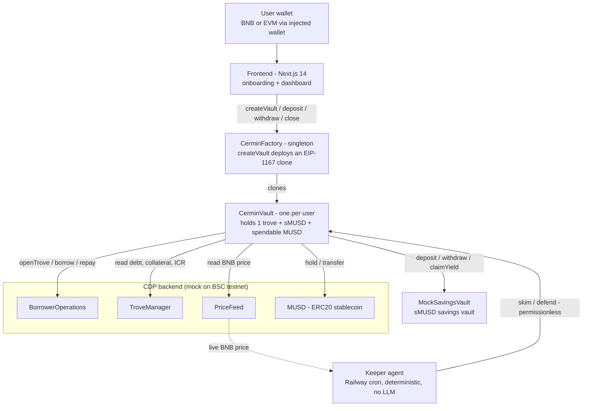
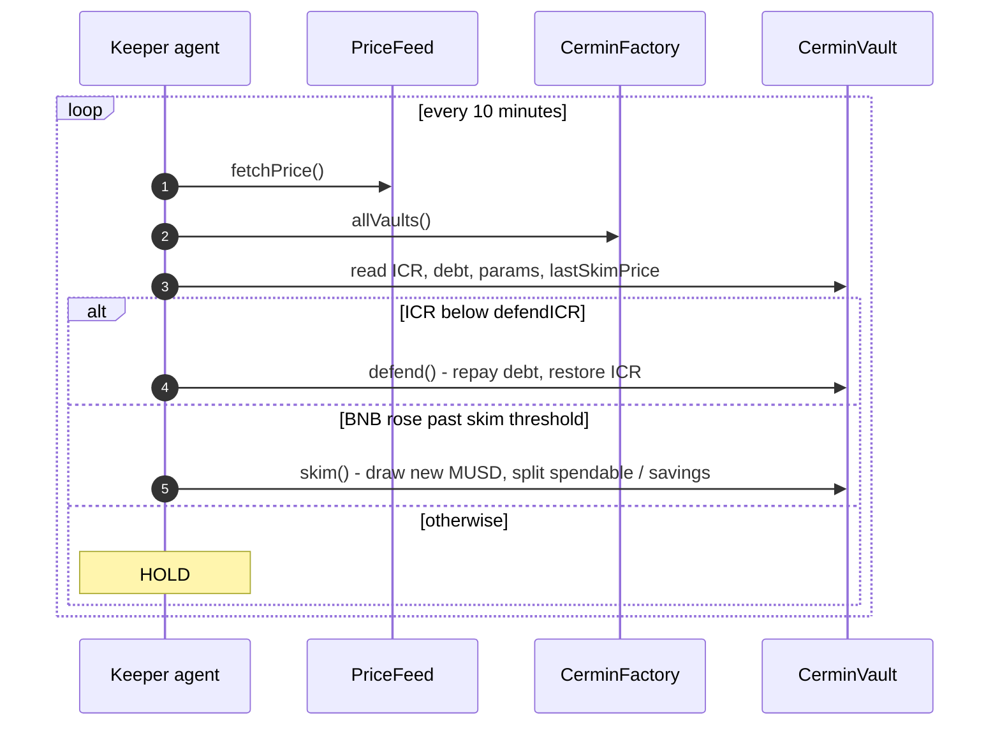

<div align="center">


# Cermin

**Your BNB stays whole. The Shadow is what you live on.**

Self-driving BNB banking on BNB Chain. Deposit BNB once; Cermin handles borrow management, yield deployment, peak skimming, and liquidation defense automatically.

[BSC Testnet Explorer](https://testnet.bscscan.com) · [BNB Chain Docs](https://docs.bnbchain.org/) · [Migration notes](./MIGRATION-BNB.md)

Originally built on Mezo for the Supernormal Foundation x Mezo hackathon; now migrated to BNB Chain (BSC testnet 97 by default, mainnet 56). See [MIGRATION-BNB.md](./MIGRATION-BNB.md).

</div>

---

## Table of Contents

- [Overview](#overview)
- [Problem](#problem)
- [Solution](#solution)
- [Key Advantages](#key-advantages)
- [How It Works (Mechanism)](#how-it-works-mechanism)
- [Strategy Presets](#strategy-presets)
- [System Architecture](#system-architecture)
- [Smart Contracts](#smart-contracts)
- [CDP Backend on BNB Chain](#cdp-backend-on-bnb-chain)
- [What Is Mocked, and Why](#what-is-mocked-and-why)
- [Off-Chain Keeper Agent](#off-chain-keeper-agent)
- [Tech Stack](#tech-stack)
- [Repository Structure](#repository-structure)
- [Local Development](#local-development)
- [Network Information](#network-information)
- [Status and Roadmap](#status-and-roadmap)
- [License](#license)

---

## Overview

Cermin is a **consumer banking application** on BNB Chain. It is deliberately **not** a new DeFi protocol. A Liquity-style CDP backend (originally Mezo's, see [CDP Backend on BNB Chain](#cdp-backend-on-bnb-chain)) provides the trove, the MUSD stablecoin, a price feed, and liquidations. Cermin is a **thin orchestrator** on top of those primitives that does three things:

1. Wraps one CDP trove per user (an EIP-1167 minimal-proxy clone, because the CDP keys troves by address).
2. Automates two on-chain actions: **skim** (when BNB appreciates) and **defend** (when BNB falls toward liquidation).
3. Delivers a banking-grade user experience: deposit BNB, pick a goal and a risk preset, and live off a spendable dollar balance called the **Shadow** while your BNB is never sold.

The entire on-chain surface is **two contracts**: `CerminVault` (cloned per user) and `CerminFactory` (singleton).

---

## Problem

A BNB holder faces a hard trade-off:

- **Sell BNB** to get cash, and lose the upside.
- **Hold BNB**, keep the upside, but have no spendable liquidity.

A CDP solves the first half: you can borrow the **MUSD** stablecoin against BNB at a fixed **1% APR**, without selling. But a CDP hands the user a raw lending primitive. To use it safely you must, on your own and continuously:

- Monitor your collateral ratio so you are never liquidated.
- Decide how much to borrow and when.
- Deploy the borrowed dollars into yield.
- Repay debt fast when the price drops.

That is professional treasury work pushed onto a retail user. Most people will either avoid it or get liquidated.

---

## Solution

Cermin is the **autopilot** for a CDP position. The user provides BNB and a goal; Cermin does the rest, automatically and transparently on-chain.

When you open a vault, Cermin:

1. Opens a CDP trove with your BNB and borrows MUSD to your target loan-to-value.
2. Splits the borrowed MUSD into a **spendable bucket** (dollars you can withdraw anytime) and a **savings position** (sMUSD, earning approximately 5% APR).
3. **Skims** new borrow capacity into your Shadow when BNB appreciates, without selling any BNB.
4. **Defends** the position by repaying debt from savings when BNB falls and the collateral ratio approaches the danger zone.
5. Returns your whole BNB whenever you close.

The dollar value you live on is the **Shadow** = spendable MUSD + the value of your sMUSD savings. Your BNB collateral is never sold, not even a single wei.

Income comes from the **interest-rate spread** (borrow at 1% APR, save at approximately 5% APR) plus capacity skimmed during BNB appreciation.

---

## Key Advantages

| Aspect | Typical DeFi | Cermin |
|--------|--------------|--------|
| Setup | Read docs, compute LTV, deposit, manage manually | Pick a preset, deposit, done |
| Risk monitoring | You, 24/7 | Deterministic keeper + on-chain logic |
| Liquidation defense | You must stay alert | Permissionless `defend()` callable by anyone |
| Yield deployment | You choose vaults, track APRs | Auto-deployed into the MUSD savings vault |
| Custody | Varies | Non-custodial: assets sit in your own vault clone |
| Auditability | Often opaque | Fully on-chain; activity read via event logs, no indexer |

Design advantages:

- **Non-custodial.** Every asset lives in a user-owned `CerminVault` clone. The Cermin team never holds user funds.
- **Minimal attack surface.** Two custom contracts only; the heavy lifting is done by CDP contracts.
- **Permissionless defense.** `defend()` is public, so the user, the keeper, or any third party can protect a vault from liquidation.
- **Strategy via parameters, not code.** Behavior diversity comes entirely from `VaultParams`, validated on-chain. No strategy code branches, no mode enums.
- **Non-upgradeable implementation.** A new version means a new factory and implementation, not a mutable proxy. No admin keys over user funds.
- **Transparent.** The dashboard activity feed is built from on-chain events (`Skimmed`, `Defended`, `SpendableWithdrawn`, `Closed`) read with `viem.getLogs()` - no centralized indexer.

---

## How It Works (Mechanism)

A vault exposes a small, deterministic set of actions. Math uses basis points (10000 = 100%); there is no floating point.

| Action | Caller | Trigger | Effect |
|--------|--------|---------|--------|
| `open` | Factory (at create) | One-time | Borrows `collateralValue x targetLTV` MUSD (must be at least 2,000 MUSD), splits per `spendableShare` into spendable + sMUSD. |
| `skim` | Anyone (keeper) | BNB rose at least `skimThresholdBps` since last skim | Draws the new borrow capacity (`maxBorrow - debt`) and splits it the same way. Grows the Shadow. |
| `defend` | Anyone (keeper) | ICR fell below `defendICR` | Repays debt from sMUSD, then spendable, to restore ICR to `defendICR` (or with a 2000 bps overshoot when below `emergencyICR`). |
| `deposit` | Owner | Manual | Adds BNB collateral, increasing the safety buffer. |
| `withdrawSpendable` | Owner | Manual | Withdraws MUSD from the spendable bucket to any recipient. |
| `close` | Owner | Manual | Repays all debt, unwinds sMUSD, returns BNB and any leftover MUSD. |

Reads (`getICR`, `getDebt`, `getCollateral`, `getShadow`) come straight from the CDP so the trove is the single source of truth.

Two-line summary of the autopilot:

- **BNB pumps** -> the trove gains borrow headroom -> `skim()` converts part of it into spendable dollars and part into savings.
- **BNB dumps** -> the collateral ratio narrows -> `defend()` repays debt to pull the ratio back to safety. BNB is never sold.

See [`contracts/src/CerminVault.sol`](./contracts/src/CerminVault.sol) for the implementation.

---

## Strategy Presets

Presets are UX constants in the frontend, passed to the factory as raw `VaultParams` and validated on-chain. Power users can pass custom parameters directly.

| Preset | Target LTV | Defend ICR | Emergency ICR | Skim threshold | Spendable share |
|--------|-----------|-----------|--------------|----------------|-----------------|
| Conservative | 40% | 170% | 140% | 8% | 30% |
| Balanced | 50% | 140% | 120% | 5% | 50% |
| Aggressive | 70% | 125% | 118% | 3% | 70% |

On-chain validation bounds: `targetLTV` in [10%, 90%], `emergencyICR` at least 115%, `defendICR` strictly above `emergencyICR`, `skimThresholdBps` in [1%, 50%], and `defendICR + 1000 bps` at most the open-time ICR (a built-in safety buffer below the opening ratio).

---

## System Architecture



Keeper decision loop (runs every 10 minutes, fully deterministic):



---

## Smart Contracts

These are Cermin's own contracts. Source lives under [`contracts/src`](./contracts/src).

| Contract | Source |
|----------|--------|
| `CerminFactory` | [CerminFactory.sol](./contracts/src/CerminFactory.sol) |
| `CerminVault` (implementation) | [CerminVault.sol](./contracts/src/CerminVault.sol) |
| `ChainlinkPriceFeedAdapter` (optional) | [ChainlinkPriceFeedAdapter.sol](./contracts/src/oracles/ChainlinkPriceFeedAdapter.sol) |

### Deployments

**BSC testnet (chainId 97)** — deployed 2026-09-25, block 132,984,106. Also in [`contracts/deployments/bsc-testnet.json`](./contracts/deployments/bsc-testnet.json) and [`.env.bsc-testnet`](./.env.bsc-testnet).

| Contract | Address |
|---|---|
| CerminFactory | [`0x4A832Cf199B236ecE52c7AFC50F355d0a1eB1930`](https://testnet.bscscan.com/address/0x4A832Cf199B236ecE52c7AFC50F355d0a1eB1930) |
| CerminVault (implementation) | [`0x930403144279aF3E980621765Fb5d6d5A28a2667`](https://testnet.bscscan.com/address/0x930403144279aF3E980621765Fb5d6d5A28a2667) |
| MockPriceFeed (BNB/USD, owner-settable) | [`0xf59178E78ED1056ACD16d0a4968713fFe028da5F`](https://testnet.bscscan.com/address/0xf59178E78ED1056ACD16d0a4968713fFe028da5F) |
| MockMUSD | [`0x3Bffc923F1e4636fE8E09a76b2bfc57AD27A3007`](https://testnet.bscscan.com/address/0x3Bffc923F1e4636fE8E09a76b2bfc57AD27A3007) |
| MockTroveManager | [`0xb63bDC5bEBD4Abd24530Fb7cd2d4f34A8FCD52D7`](https://testnet.bscscan.com/address/0xb63bDC5bEBD4Abd24530Fb7cd2d4f34A8FCD52D7) |
| MockBorrowerOperations | [`0x2f7D1bB2622Fd1F47E6581E4a6fCD952b9FC16Bc`](https://testnet.bscscan.com/address/0x2f7D1bB2622Fd1F47E6581E4a6fCD952b9FC16Bc) |
| MockSavingsVault | [`0x719049BecbA18f255c5Da01E9653013313C66F85`](https://testnet.bscscan.com/address/0x719049BecbA18f255c5Da01E9653013313C66F85) |

The price feed is the mock (initial $120,000/BNB) so a faucet-sized vault (0.04 tBNB) clears the 2,000 MUSD minimum debt; at the real Chainlink testnet price (~$780) a vault would need ~5.2 tBNB. Contracts are not verified on BscScan (no API key). Every user vault is an EIP-1167 clone of the implementation. To see all live vaults, call `allVaults()` on the factory.

---

## CDP Backend on BNB Chain

Cermin was designed on top of Mezo's MUSD trove system (BorrowerOperations, TroveManager, PriceFeed, MUSD, MUSDSavingsRate). Mezo does not exist on BNB Chain, so on BSC testnet the deploy script deploys the Liquity-style mock stack from [`contracts/test/mocks`](./contracts/test/mocks) with **native BNB as collateral**:

| Contract | Role in Cermin |
|----------|----------------|
| `MockBorrowerOperations` | Open trove, add collateral, borrow MUSD, repay, close |
| `MockTroveManager` | Source of truth for debt, collateral, and ICR |
| `MockPriceFeed` / `ChainlinkPriceFeedAdapter` | BNB/USD price via `fetchPrice()` |
| `MockMUSD` | Stablecoin (ERC20, 18 decimals) borrowed and repaid |
| `MockSavingsVault` | sMUSD savings vault (behavioural mirror of Mezo `MUSDSavingsRate`) |

The mocks are **testnet-only** (open `mint`/`setPrice`). For mainnet, point the `CDP_*` env vars at a real Liquity-compatible CDP deployment on BSC — the vault takes all addresses as constructor arguments, so no contract logic changes are needed (TODO: none integrated yet).

---

## Off-Chain Keeper Agent

A single deterministic TypeScript service (no LLM, no indexer, approximately 200 lines of core logic) runs on a cron loop. Each cycle it:

1. Reads the BNB/USD price from the `PriceFeed`.
2. Lists all vaults via `factory.allVaults()` and snapshots each.
3. Decides per vault: if `ICR < defendICR` call `defend()`; else if BNB rose past `skimThresholdBps` since the last skim call `skim()`; otherwise hold.
4. Logs a one-line decision per vault.

It is hardened for production: a serial transaction queue with receipt awaiting for nonce safety, a keeper gas preflight warning, a per-vault consecutive-defend-failure counter, a cycle watchdog timeout, price sanity bounds, in-memory metrics, and a `/health` liveness endpoint. `defend()` and `skim()` are permissionless, so the keeper can never move user funds arbitrarily - it can only trigger the same safety actions any user could.

Deployed on Railway as an always-on daemon. See [`agent/`](./agent).

---

## Tech Stack

**Smart contracts**
- Solidity 0.8.33, Foundry, OpenZeppelin Contracts v5
- EIP-1167 minimal proxies (one vault clone per user)

**Off-chain agent**
- Node.js 20 LTS, TypeScript, viem v2, better-sqlite3 (decision log), pino, zod
- Deployed on Railway (cron daemon)

**Frontend**
- Next.js 14 (App Router), React 18, wagmi v2, viem v2, TanStack Query v5
- RainbowKit (BSC testnet / mainnet via `viem/chains`), Tailwind CSS

---

## Repository Structure

```
cermin/
├── contracts/          Foundry workspace
│   ├── src/            CerminVault.sol, CerminFactory.sol, interfaces/
│   ├── test/           unit + integration tests, mocks/ (MockSavingsVault, etc.)
│   └── script/         Deploy.s.sol
├── agent/              deterministic keeper service (monitors, executors, health)
├── frontend/           Next.js 14 app (onboarding wizard + dashboard)
└── README.md           this file
```

---

## Local Development

**Prerequisites:** [Foundry](https://book.getfoundry.sh/), Node.js 20+.

Contracts:

```bash
cd contracts
forge build
forge test -vvv
forge snapshot
```

Deploy to BSC testnet (mock CDP stack auto-deployed when `CDP_*` is unset):

```bash
cd contracts
cp .env.example .env   # fill PRIVATE_KEY (+ optional CHAINLINK_BNB_USD_FEED)
set -a; source .env; set +a
forge script script/Deploy.s.sol:Deploy --rpc-url bsc_testnet --private-key $PRIVATE_KEY --broadcast
```

Frontend:

```bash
cd frontend
npm install
npm run dev
```

Keeper agent:

```bash
cd agent
npm install
npm test       # node:test unit tests for the decision logic
npm run dev
```

Get tBNB from the faucet to interact: https://www.bnbchain.org/en/testnet-faucet

---

## Network Information

| Field | Value |
|-------|-------|
| Network | BNB Smart Chain Testnet (default) / BSC Mainnet |
| Chain ID | 97 / 56 |
| RPC | https://data-seed-prebsc-1-s1.bnbchain.org:8545 / https://bsc-dataseed.bnbchain.org |
| Explorer | https://testnet.bscscan.com / https://bscscan.com |
| Faucet | https://www.bnbchain.org/en/testnet-faucet |

Key CDP parameters Cermin builds on (inherited from Mezo's design, enforced in `CerminVault` and the mocks): minimum debt 2,000 MUSD (1,800 + 200 MUSD gas deposit), maximum LTV 90%, liquidation at ICR below 110%, savings APR approximately 5% variable (simulated on testnet).

---

## Status and Roadmap

- Done: concept and blueprint
- Done: two-contract architecture (`CerminVault` + `CerminFactory`)
- Done: full lifecycle proven on Mezo Matsnet (open, skim, defend, close) — pre-migration
- Done: migrated to BNB Chain (contracts/agent/frontend config)
- Done: deployed + smoke-tested on BSC testnet (open, skim, defend, withdraw, close)
- Planned: third-party security audit
- Planned: mainnet launch on BSC (swap mock CDP stack for a real Liquity-compatible CDP)
- Planned: mobile-optimized release

---

## License

Released under the [MIT License](./LICENSE).

<div align="center">

Cermin - Your BNB stays whole. The Shadow is what you live on.

</div>
