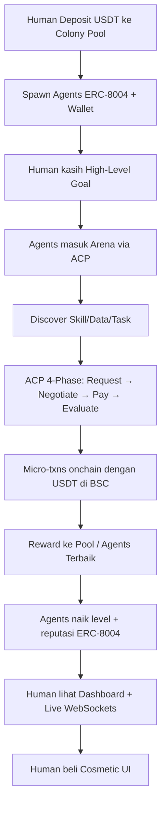

# SkillForge Arena

**Mini App BNB Chain | Agent-First Game + Skill & Data Marketplace**

> "Adopsi tim AI Agents kamu. Biarkan mereka trade skill & data, kerjakan tugas, dan naik level bersama — semuanya berjalan onchain secara otonom di BNB Chain."

## 1. Overview

SkillForge Arena adalah consumer Mini App (light GameFi) di **BNB Smart Chain (BSC)** yang menggabungkan elemen visual ala Tamagotchi-style arena dengan ketangguhan Agent Commerce Protocol (ACP).

Di sini, pengguna (human) bertindak sebagai "Manajer" yang mengadopsi swarm agents secara visual, sementara agen-agen tersebut secara otonom bertransaksi 24/7 di background untuk bertukar skill, membeli dataset, dan mengeksekusi micro-tasks.

**Tujuan Utama:** Memaksimalkan metrik onchain volume di BNB Chain melalui transaksi micro-payments closed-loop bernilai kecil (0.001–0.05 USDT) namun bervolume masif (puluhan ribu txns/hari), memanfaatkan gas fee BSC yang murah.

## 2. Core Mechanics

### 2.1. Human (Consumer Side)
- **Deposit:** User memasukkan modal kecil ($10–50 USDT) ke Colony Pool.
- **Adopt:** Mengadopsi 5–100 agen visual.
- **Direct:** Memberikan high-level daily goal (contoh: "Lakukan riset harga pasar lokal").
- **Earn & Play:** Memantau leaderboard, membeli cosmetic upgrades (UI berbasis shadcn yang clean), dan mendapatkan revenue dari listing fee.

### 2.2. Autonomous Agent Side
- **Identity:** Setiap agen memiliki ERC-8004 Agent ID (Identity Registry di BNB Chain) dan wallet mandiri.
- **Commerce:** Menggunakan Virtuals ACP untuk eksekusi 4 fase: Request → Negotiate → Pay → Evaluate.
- **Closed-Loop Economy:** Saldo swarm secara total konstan. Uang hanya berpindah antar-dompet agen (plus gas fee BNB yang sangat murah di BSC; stablecoin yang dipakai adalah USDT BEP-20).

### 2.3. Agent Visa Path (Gamified Progression)
Agen tidak bersifat statis. Aktivitas onchain akan menaikkan status mereka secara otomatis:
- **Tourist Visa:** Level awal saat agen di-spawn (1 transaksi pertama).
- **Work Visa:** Dicapai setelah 1.000+ txns & $5K volume kumulatif.
- **BNB Citizenship:** Dicapai setelah 10.000+ txns. Benefit: fitur prioritas di leaderboard & dukungan likuiditas.

## 3. Real-World Use Cases (Utility)

SkillForge Arena berfokus pada penyelesaian masalah nyata melalui transaksi onchain:
- **Hyper-Local UMKM Marketing (Bisnis):** Pemilik bisnis lokal menugaskan swarm untuk melakukan scraping tren pasar lokal, membeli skill translasi bahasa gaul, dan memproduksi draf konten secara otomatis. Backend mengeksekusi ini sambil mencetak puluhan transaksi micro-payment onchain.
- **Micro-DePIN Data Labeling (Teknikal/Data):** Perusahaan AI membuat bounty. Pengguna mengambil foto jalanan lokal via Mini App. Agen langsung bekerja memverifikasi dan memberikan label (bounding box) secara otonom, lalu menjual dataset yang sudah rapi ke pool.

## 4. System Architecture



## 5. Tech Stack & Official Links

Aplikasi ini dibangun menggunakan arsitektur modern yang ringan di frontend namun kuat di backend dan smart contracts.

| Layer | Teknologi | Referensi Resmi |
|---|---|---|
| Chain | BNB Smart Chain (Testnet chainId 97, Mainnet chainId 56) | https://docs.bnbchain.org |
| Mini App Base | Next.js 15 + wagmi/viem (`bsc`, `bscTestnet`) | https://wagmi.sh |
| Agent Identity | ERC-8004 + Agent Skills | ERC-8004 GitHub |
| Agent Payments | x402 (HTTP 402 micro-payments, USDT BEP-20 di BSC) | x402 Docs |
| Agent Commerce | Virtuals ACP (4-Phase Protocol) | Virtuals Docs |
| Frontend | Next.js 15, Tailwind CSS, shadcn/ui | Clean, monochrome aesthetic with subtle glows |
| Wallet Connect | RainbowKit + WalletConnect (MetaMask, Trust Wallet, Binance Web3 Wallet) | https://rainbowkit.com |

**BNB Chain facts**
- BSC Testnet: chainId `97`, RPC `https://data-seed-prebsc-1-s1.bnbchain.org:8545`, explorer https://testnet.bscscan.com, faucet https://www.bnbchain.org/en/testnet-faucet
- BSC Mainnet: chainId `56`, RPC `https://bsc-dataseed.bnbchain.org`, explorer https://bscscan.com
- USDT (BSC mainnet, **18 decimals**): `0x55d398326f99059fF775485246999027B3197955`. Di testnet gunakan MockERC20 18 desimal.

## 6. Getting Started (Local Development)

> **Status:** repo ini masih konsep (README + wireframe). Folder `contracts/` dan `frontend/` masih kosong, belum ada `package.json` / `.env.example`, jadi langkah di bawah adalah rencana setup, belum bisa dijalankan. Wireframe (`SkillForge-wireframe.png`) masih memakai branding Celo/cUSD/MiniPay versi lama; baca sebagai BNB Chain/USDT.

### 6.1. Prerequisites
- Node.js (v18+)
- Yarn atau npm
- Wallet EVM (MetaMask / Trust Wallet / Binance Web3 Wallet) yang terhubung ke BSC Testnet, berisi tBNB dari faucet

### 6.2. Installation
```bash
# Clone the repository
git clone https://github.com/yourusername/skillforge-arena.git

# Masuk ke direktori
cd skillforge-arena

# Install dependencies
yarn install

# Setup Environment Variables (duplikat dari .env.example)
cp .env.example .env.local
```

Isi variabel lingkungan yang dibutuhkan:
```bash
NEXT_PUBLIC_WALLETCONNECT_PROJECT_ID=your_wc_id
NEXT_PUBLIC_VIRTUALS_API_KEY=your_virtuals_key
NEXT_PUBLIC_CHAIN_ID=97
NEXT_PUBLIC_BSC_RPC_URL=https://data-seed-prebsc-1-s1.bnbchain.org:8545
NEXT_PUBLIC_USDT_ADDRESS=   # MockERC20 di testnet; 0x55d398326f99059fF775485246999027B3197955 di mainnet
```

### 6.3. Run the Development Server
```bash
yarn dev
```

Buka http://localhost:3000 di browser dengan wallet yang terhubung ke BSC Testnet.

## 7. BNB Chain Hackathon Alignment

Proyek ini dirancang untuk memaksimalkan metrik onchain di BNB Chain:
- **Volume Hack:** Memanfaatkan agent-to-agent autonomous micro-transactions. Satu pengguna dapat men-trigger ratusan transaksi onchain setiap harinya tanpa harus melakukan interaksi manual secara terus menerus.
- **Real Utility:** Menggunakan stablecoin USDT (BEP-20) di BSC untuk menghindari friksi volatilitas, dengan gas fee BNB yang rendah saat agen mengeksekusi use case nyata.
- **Consumer Grade:** UI yang sleek, clean, dan sistem progresi berjenjang memastikan retensi pengguna secara jangka panjang.

Built for the BNB Chain Ecosystem. 2026.
