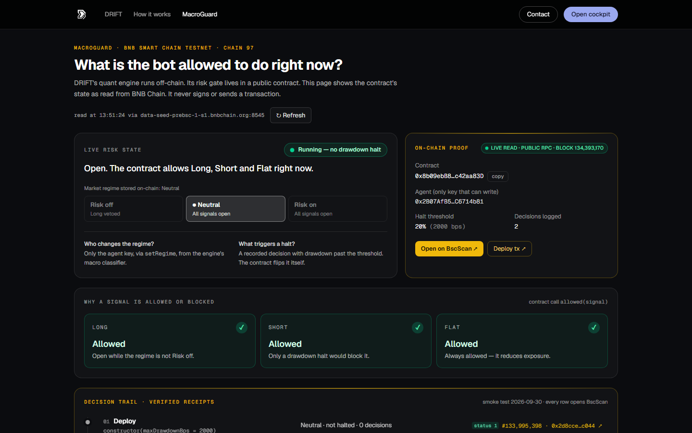
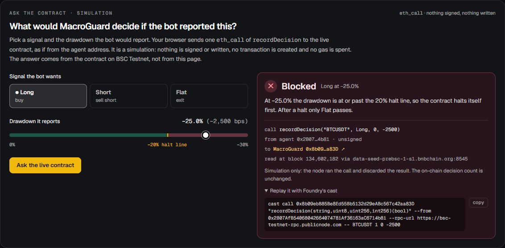
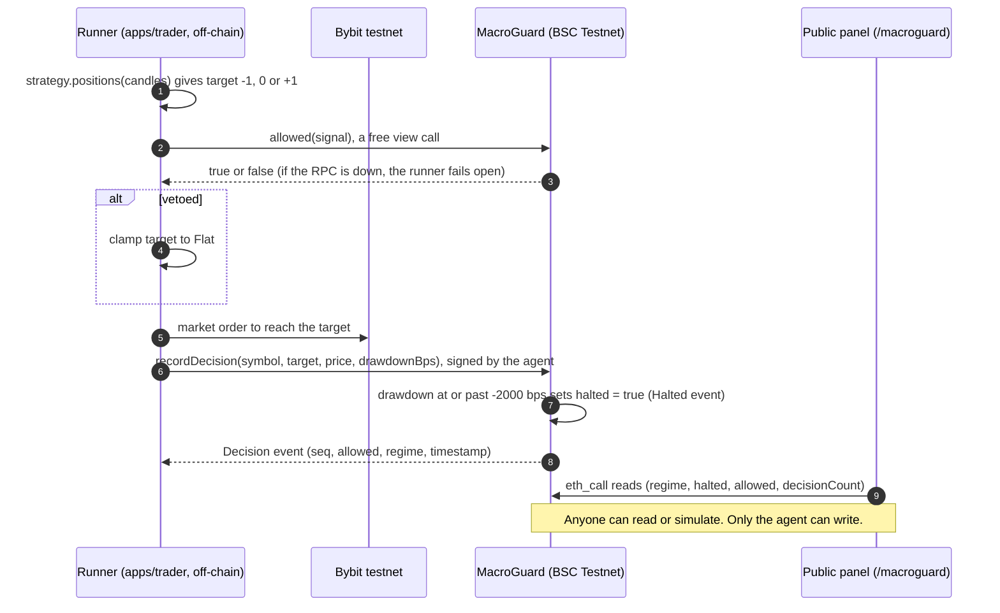
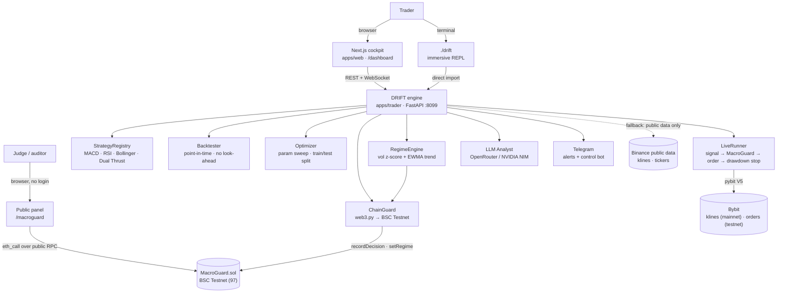

<div align="center">

# DRIFT

### A trading bot whose risk rules you can verify — risk gate on BNB Chain.

*Quant research runs off-chain. The risk gate, MacroGuard, is a public contract on BNB Smart Chain Testnet: anyone can read what the bot is allowed to do right now, ask the contract a what-if, and open every recorded decision on BscScan.*

**[Live demo](https://drift-macroguard.vercel.app)** · **[Public risk gate: `/macroguard`](https://drift-macroguard.vercel.app/macroguard)** · Demo video: not published yet · **[Contract on BscScan (testnet)](https://testnet.bscscan.com/address/0x8b09ebB85Be8Ed55Bb5132d29eABc567c42aa83D)** · **[Source on Sourcify](https://repo.sourcify.dev/97/0x8b09ebB85Be8Ed55Bb5132d29eABc567c42aa83D)** · **[Pitch deck (PDF)](docs/submission/DRIFT-pitch.pdf)**

[-F0B90B?logo=binance&logoColor=white)](https://testnet.bscscan.com/address/0x8b09ebB85Be8Ed55Bb5132d29eABc567c42aa83D)
[](https://repo.sourcify.dev/97/0x8b09ebB85Be8Ed55Bb5132d29eABc567c42aa83D)
[](https://github.com/Stylenecy/seed-bnb/actions/workflows/drift-ci.yml?query=branch%3Adex%2Fdrift)
[](https://www.python.org/)
[](https://nextjs.org)
[](https://book.getfoundry.sh/)

</div>



---

## Proof on BNB Chain

Dex Bennett's own MacroGuard deployment: [`0x8b09ebB85Be8Ed55Bb5132d29eABc567c42aa83D`](https://testnet.bscscan.com/address/0x8b09ebB85Be8Ed55Bb5132d29eABc567c42aa83D) on BSC Testnet (chain 97), agent `0x2B07AfB54068042664074781Af36163aC6714b81`, halt line 2000 bps (20%). Source verified on [Sourcify](https://repo.sourcify.dev/97/0x8b09ebB85Be8Ed55Bb5132d29eABc567c42aa83D) (exact match, 2 Oct 2026). Every transaction below has receipt status 1; full record in [`docs/deployment-dex.md`](docs/deployment-dex.md).

| # | On-chain call (30 Sep 2026) | What it proves | Block · gas | Transaction |
|---|---|---|---|---|
| 1 | `constructor(2000)` | Dex's own contract; the deployer is the only agent; halt line 20% | 133,995,398 · 449,207 | [`0x2d8c…c044`](https://testnet.bscscan.com/tx/0x2d8cce2de583424a45e8de176c1b79438cdf54f7a016ae0cfc6c4ca86078c044) |
| 2 | `setRegime(RiskOff)` | Risk off vetoes Long; Short and Flat stay open | 134,042,196 · 27,790 | [`0x563f…6858`](https://testnet.bscscan.com/tx/0x563f1eee78fee6a0b532c6ae50ab5de05667e7d64bb573ddc21596b9d2376858) |
| 3 | `recordDecision(BNB, Short, -100 bps)` | A safe decision is logged (#1); no halt | 134,042,256 · 33,189 | [`0x7a51…4810`](https://testnet.bscscan.com/tx/0x7a5185e4beb1c51f6c1fcaeb7614df88a5dd72357caa38ab7e15956500ab4810) |
| 4 | `recordDecision(BNB, Short, -2500 bps)` | Past the line, the contract halts itself (`Halted` event); only Flat is allowed | 134,042,283 · 34,323 | [`0x8e34…62ef`](https://testnet.bscscan.com/tx/0x8e346d74c06c53f2f8914c86c4be9e45c49ea99a54e41ece6fc53a018e3b62ef) |
| 5 | `resume()` | Only the agent can resume, and it is on the record (`Resumed` event) | 134,042,318 · 27,030 | [`0xda57…18ae`](https://testnet.bscscan.com/tx/0xda579ebbf2969b855fe50b4520593fb267e33f4db062e0c71c48ca64b18d18ae) |
| 6 | `setRegime(Neutral)` | Back to Neutral; Long allowed again; 2 decisions on-chain | 134,042,328 · 27,802 | [`0xa846…486b`](https://testnet.bscscan.com/tx/0xa846652354020a77b8c24ef8bb3e088ccecb63f4c2c3267c0a4377c57a39486b) |

A `setRegime(2)` sent from any other address (simulated with `eth_call` from `0x…dEaD`) reverts with `NotAgent()` (`0x0d9ab13f`). At the testnet gas price of 0.1 gwei, one recorded decision (33–34k gas) costs about 0.0000034 tBNB.

**What this does not prove.** The contract does not execute exchange orders. The runner fails open to its local stop if the RPC is unreachable. The agent can `resume()` a halt at any time. The drawdown is reported by the agent, not measured by the contract. No live bot tick and no profit are claimed; backtests are research. Details: [`docs/THREAT-MODEL.md`](docs/THREAT-MODEL.md).

## Judge path (3 minutes)

1. **Open [`/macroguard`](https://drift-macroguard.vercel.app/macroguard)** (no login, no wallet). The badge reads `live read · public RPC · block <n>`: the page read the contract from your browser just now. Check regime, halt state, the 20% line and the decision count.
2. **Read the verdicts.** Long, Short and Flat each show Allowed or Blocked with the rule behind it, from `allowed(signal)`.
3. **Ask the contract.** Pick Long, slide the drawdown to −25% and ask: the live contract answers *Blocked* (it would halt itself first). Pick Flat: *Allowed*. It is an `eth_call` from the agent address, so nothing is signed or written; copy the `cast` command under the answer to replay it yourself.
4. **Open a receipt.** In the decision trail, block 134,042,283 is the halt. Every row opens BscScan.
5. **Read the source.** Sourcify shows the verified `MacroGuard.sol`; the whole gate is `allowed()`, lines 59–63.
6. *(Optional, 2 min)* Run the tests: `forge test`, `pytest`, `npm test` (see [Tests](#tests)).



## One tick, end to end



Legend: solid arrows are calls, dashed arrows are answers or events. Off-chain: the runner and the exchange. On-chain: MacroGuard. The panel only reads.

## Built during the hackathon

### This fork's contribution

DRIFT's core (the quant engine, the cockpit and `MacroGuard.sol`) comes from the upstream DRIFT project, built for a Mantle hackathon track ("AI Trading & Strategy", June 2026) and migrated to BNB Chain in `bcc-ukdw/seed-bnb` (commit `52671ce`, 29 Sep 2026). Dex Bennett's contribution in this fork: the MacroGuard transparency panel (`/dashboard/macroguard` and the public `/macroguard`), the read-only `/guard/state` API, contract reads straight from the browser over a public RPC (no engine needed), an "Ask the contract" what-if that simulates `recordDecision` with `eth_call` (nothing signed), a labelled Binance public-data fallback for the engine, honest copy corrections, a self-owned MacroGuard deployment with an on-chain smoke test (30 Sep 2026), source verification on Sourcify, contract fuzz and invariant tests, an offline engine test suite, CI, a threat model, the judge-facing landing page and visual system, the PRD and the pitch deck.

| Date (2026) | Work by Dex Bennett in this fork |
|---|---|
| 29 Sep | Read-only MacroGuard transparency panel and the `/guard/state` API |
| 30 Sep | Own MacroGuard deployment on BSC Testnet and a five-transaction smoke test, all status 1 |
| 1 Oct | PRD and visual direction; redesigned panel (live state, verdicts, receipt trail); landing story; phone layout; first deck |
| 2 Oct | Source verified on Sourcify; contract reads straight from the browser, with its first 7 web tests; provenance and honest copy; public demo on Vercel |
| 3 Oct | "Ask the contract"; labelled Binance data fallback; 23 contract tests, 48 engine tests and 8 web tests added; CI workflow; threat model; share card; this README; deck v2 |

Commit history: [`dex/drift`, commits under `drift/`](https://github.com/Stylenecy/seed-bnb/commits/dex/drift/drift).

## What came from upstream

The quant engine (`apps/trader`: strategies, backtester, optimizer, regime engine, live runner, LLM analyst, Telegram bot), the terminal, the web cockpit and `MacroGuard.sol`. The BNB Chain migration is the seed commit `52671ce` in `bcc-ukdw/seed-bnb` (29 Sep 2026), authored by `yeheskieltame`; its records are [`MIGRATION-BNB.md`](MIGRATION-BNB.md) and [`VERIFY-BNB.md`](VERIFY-BNB.md). The upstream code names no author of DRIFT: its landing page listed only a contact email (`apps/web/src/features/landing/site.ts` at `52671ce`), which this fork replaced with Dex's own contact for the demo. The original author's name and the license will be added once confirmed. The four strategies are ported from [je-suis-tm/quant-trading](https://github.com/je-suis-tm/quant-trading).

---

## Tests

| Layer | Command | Count | Notes |
|---|---|---|---|
| Contract | `cd contracts && forge test` | 30 (7 upstream + 23 added) | Unit and event tests, 5 fuzz tests, 7 invariants over random agent and stranger call sequences. `forge coverage`: 100% of lines, statements, branches and functions in `MacroGuard.sol`. The contract itself is unchanged. |
| Engine | `cd apps && pip install -r trader/requirements-dev.txt && python -m pytest trader/tests -c trader/pytest.ini` | 48 passed, 1 strict xfail | Offline: `.env` loading is disabled and any non-loopback connection or DNS lookup fails the test. Covers no look-ahead as a property, the backtester's one-bar shift, the train/test split, the regime classifier, ChainGuard, the API and the data fallback. The xfail pins a known upstream bug (below). |
| Web | `cd apps/web && npm test` | 15 (7 added on 2 Oct, 8 on 3 Oct) | Contract reads and the what-if encoder against `cast` fixtures, RPC fallback, reverts, wrong chain. |

**No look-ahead, tested as a property.** For every strategy, `positions(df[:k])` equals `positions(df)[:k]` at every cut `k`, and rewriting future candles never changes a past position. A test strategy that cheats by trading on its own candle looks like a money machine without the backtester's one-bar shift and loses that edge with it (asserted on a seeded synthetic random walk in `apps/trader/tests/test_backtester.py`).

**CI.** [`.github/workflows/drift-ci.yml`](../.github/workflows/drift-ci.yml) runs all three layers on every change under `drift/`: forge test and coverage, pytest, then `npm ci`, lint, node tests and `next build`.

**Known issues found while testing (not fixed here):** `BNBUSDT` is listed twice in `MARKET_SYMBOLS` (`apps/trader/app/main.py`, `apps/trader/app/cli.py`), so the markets view shows it twice; the live runner records the post-veto target, so a vetoed Long appears on-chain as Flat. Both are pinned by tests; see [`docs/THREAT-MODEL.md`](docs/THREAT-MODEL.md).

---

## What is DRIFT?

Most trading bots sell a backtest you can't trust — fit in hindsight, leaking future information, and wrapping discretionary risk in a promise. **DRIFT is a quant-trading cockpit built to be checked.**

Browse four classical strategies, backtest them on real market history under strict point-in-time rules, let the optimizer find what actually survives out-of-sample, and deploy a bot where a per-bot drawdown stop is enforced in code. A Solidity risk guard on BNB Chain can veto signals and record decisions sent by the agent, creating a public audit trail for successful transactions.

It ships as three things on one engine:

- **A terminal agent** (`./drift`) — an immersive full-screen REPL with live markets, backtests, an AI analyst, and live bots. Just talk to it.
- **A web cockpit** (`apps/web`) — a consumer dashboard with candlestick charts, per-bot equity streams, an auto-research optimizer, and the public MacroGuard panel.
- **A Python FastAPI engine** (`apps/trader`) — the shared brain: strategy library, backtester, live bot runner, MacroGuard wiring, LLM analyst, and Telegram control bot.

> **The thesis:** an edge is only an edge if it survives an honest test. DRIFT refuses look-ahead and gives the runner a local drawdown stop plus an auditable on-chain signal gate. Successful `recordDecision` transactions form a public trail; exchange execution still depends on the off-chain runner.

---

## Features

### MacroGuard — on-chain risk gate (BSC Testnet)
- `MacroGuard.sol` targets BNB Smart Chain Testnet (chain 97); mainnet (chain 56) is a config switch. Dex's deployment: [`0x8b09ebB85Be8Ed55Bb5132d29eABc567c42aa83D`](https://testnet.bscscan.com/address/0x8b09ebB85Be8Ed55Bb5132d29eABc567c42aa83D).
- `allowed(signal)` is the veto gate: a drawdown at or past the line trips the halt until the agent calls `resume()`; risk off blocks new Longs.
- When configured, the bot attempts `recordDecision(symbol, signal, price, drawdown)` on each tick. Successful transactions create a public decision record; failed or skipped writes do not. The recorded signal is the target after the veto.
- A **regime engine** (`regime.py`) classifies BTC 1h candles into risk-on / neutral / risk-off using realised-vol z-score + EWMA trend, and pushes `setRegime` on-chain when the label changes and a key is configured. A regime classified from fallback data is shown, labelled, and never written on-chain.

### The public panel (`/macroguard`)
- Reads the contract straight from the browser over two public RPCs (with fallback): chain id, code at the address, regime, halt, threshold, decision count and `allowed()` for each signal. No engine, key or wallet.
- **Ask the contract:** pick a signal and a drawdown; the panel sends one `eth_call` of `recordDecision` from the agent address and shows the live answer, the block, the exact call and a `cast` command to replay it. Nothing is signed or written.
- Verified receipts of the smoke test, each linked to BscScan, and an honest offline state that still shows them.

### Strategy library + honest backtester
- **4 strategies** — MACD, RSI, Bollinger, Dual Thrust, ported from open research.
- **Point-in-time** — signal on bar *t* only trades on bar *t+1*; no look-ahead, no *Profit Mirage* ([arXiv:2510.07920](https://arxiv.org/abs/2510.07920)). Tested as a property (see [Tests](#tests)).
- **Real data** — backtests run on Bybit mainnet klines; when Bybit is unreachable, the engine falls back to Binance public market data and labels it (`source` in every response, a note in the cockpit and terminal). Synthetic series exist only in the test suite.
- **Honest metrics** — total return, Sharpe, win rate, max drawdown, round-trip trade count.

### Auto-Research optimizer
- Sweeps the parameter space for every strategy with a configurable grid.
- Splits data 70% train / 30% test: picks the best config by **in-sample Sharpe** (among configs with ≥2 trades), then reports **out-of-sample** metrics. Tested: rewriting the held-out slice never changes the chosen parameters.
- Verdicts: **robust** (IS ≥ 0.5 & OOS ≥ 0.5), **overfit** (IS strong, OOS collapses), **weak**.
- The winner becomes a one-click deploy.

### LLM analyst — explains, never executes
- On-demand analysis over the live computed regime and market snapshot.
- **Two providers supported:** OpenRouter (`sk-or-…`, default model `anthropic/claude-3.5-sonnet`) or NVIDIA NIM (`nvapi-…`, default `nvidia/nemotron-3-super-120b-a12b`). Detected automatically from the key prefix.
- The LLM **never touches the trade loop** — strategies, the optimizer, and the regime engine are fully deterministic. The analyst explains what the system sees.

### Conversational agent
- Type anything at the `>` prompt — unknown input routes to the LLM agent, not an error.
- Backed by an OpenAI tool-call loop over read/compute tools: `get_markets`, `get_market`, `get_regime`, `run_backtest`, `get_chain`.
- Deploy is deliberately **not a tool** — the agent hands you the exact `bot …` command instead of placing orders autonomously (human in the loop).

### Live bot runner (Bybit testnet)
- Real market orders via Bybit V5 API; nothing simulated. Live trading never uses fallback data.
- Per-bot drawdown stop flattens the position and halts on breach.
- Every tick: signal → MacroGuard veto check → order (if not vetoed) → `recordDecision` on-chain.
- Fills, equity, and chain tx streamed live over WebSocket.

### Telegram alerts + two-way control
- Alerts on regime flips, fills, and drawdown stops.
- Two-way control bot: `/status` `/regime` `/markets` `/chain` `/bots` `/analyze sym` `/deploy strat sym` `/kill id|all`.

---

## Architecture



---

## How a backtest works

```
klines ─▶ strategy.positions() ─▶ shift +1 bar ─▶ equity curve + metrics
  │              (target -1/0/1)     (no look-ahead)        │
Bybit mainnet history (labelled Binance fallback)   Sharpe · maxDD · win rate · trades
```

1. **Fetch** the most recent candles (Bybit mainnet; Binance public data if Bybit is unreachable, labelled).
2. **Signal** — the strategy maps OHLCV → target position series in `{-1, 0, 1}`.
3. **Earn it next bar** — positions shift forward one bar; no signal trades on its own candle.
4. **Score** — equity curve, drawdown, Sharpe, win rate, round-trip trade count.

---

## Strategies

| Strategy | Type | Signal | Defaults |
|----------|------|--------|----------|
| **MACD Oscillator** | Momentum | Long while fast MA > slow MA | fast=10, slow=21 |
| **RSI Reversion** | Mean reversion | Long when RSI < 30, exit > 70 (Wilder's) | period=14 |
| **Bollinger Reversion** | Mean reversion | Buy below lower band, exit at midline | window=20, k=2 |
| **Dual Thrust** | Breakout | Long/short breakout of prior close ± k·range | window=5, k=0.5 |

All four are ported from [je-suis-tm/quant-trading](https://github.com/je-suis-tm/quant-trading).

---

## Quick start

**Prerequisites:** Python 3.9+, Node 20+.

### Public panel only

Nothing to install: open [drift-macroguard.vercel.app/macroguard](https://drift-macroguard.vercel.app/macroguard). It reads the contract from your browser.

### Terminal only (fastest)

```bash
./drift          # sets up .venv + installs deps on first run, then launches
```

On first launch it prompts for an LLM API key (OpenRouter or NVIDIA NIM). Bybit read keys auto-connect from `.env.local` if present.

### Engine only (`apps/trader`)

```bash
cd apps/trader
python3 -m venv .venv && .venv/bin/pip install -r requirements.txt
.venv/bin/uvicorn app.main:app --reload --port 8099
```

Sanity check — a real backtest on live market data (the response's `source` says Bybit or Binance):

```bash
curl "http://localhost:8099/backtest?strategy=macd&symbol=BTCUSDT&timeframe=1h"
```

### Web cockpit (`apps/web`)

```bash
cd apps/web && npm install && npm run dev   # http://localhost:3000
```

The cockpit reads the engine at `http://localhost:8099` by default; override with `NEXT_PUBLIC_TRADER_URL`. Opened from any other host (such as the hosted demo) without that variable, the cockpit never calls the engine: it shows a notice instead, and `/macroguard` reads the contract straight from BNB Chain over a public RPC.

### Live bots (Bybit testnet)

Create testnet API keys at [testnet.bybit.com](https://testnet.bybit.com) with **Orders + Positions** scope, add them on the **Connection** tab or via `connect` in the terminal, then deploy a bot. Get testnet funds from the Bybit testnet faucet (API Management → "Get testnet coins").

### MacroGuard (on-chain, optional)

```bash
# in apps/trader/.env.local (or root .env.local)
MACROGUARD_ADDRESS=<your BSC testnet MacroGuard address>
ETH_PRIVATE_KEY=<your deployer key>
BSC_RPC_URL=https://data-seed-prebsc-1-s1.bnbchain.org:8545   # default (BSC Testnet, chain 97)
```

When set, every bot tick calls `recordDecision` on BSC Testnet and the regime engine pushes `setRegime` when the regime changes (checked every 15 minutes).

---

## The terminal

```bash
./drift
```

Full-screen alternate-screen REPL — pinned `sys` header + status bar (BTC/ETH/SOL live prices), scroll region in between. `readline` editing and history at `>`. Recorded output: [`SHOWCASE.md`](SHOWCASE.md).

| Command | What it does |
|---------|--------------|
| `markets` | Live prices across tracked symbols |
| `chart <sym> [tf]` | ASCII price chart |
| `strategies` | Explain all strategies with params |
| `backtest <strat> <sym> [tf]` | Point-in-time backtest + equity chart |
| `research <sym> [tf]` | Auto-Research optimizer (train/test leaderboard) |
| `analyze <sym>` | LLM analyst over the live regime |
| `bot <strat> <sym> [tf] [qty] [dd]` | Live testnet bot (Ctrl-C to flatten) |
| `connect` / `status` | Set or show Bybit connection |
| `chain` | MacroGuard contract + live regime |
| `telegram [connect\|test]` | Connect Telegram alerts + control bot |
| `clear` / `quit` | Clear screen · exit |
| *anything else* | Conversational agent (e.g. "how's btc?") |

---

## The web cockpit

| Route | What it does |
|-------|--------------|
| `/` | Landing — what DRIFT is and where to check it |
| `/macroguard` | **Public risk gate** — live contract state, verdicts, "Ask the contract", verified receipts; no login |
| `/login` | Google sign-in (gates the cockpit when `AUTH_ENABLED`) |
| `/dashboard` | **Markets** — live prices, candlestick, deploy a bot inline |
| `/dashboard/bots` | **Bots** — per-bot candlestick with fill markers, equity, P&L, MacroGuard badge |
| `/dashboard/portfolio` | **Portfolio** — account equity, running bots, positions, live P&L |
| `/dashboard/backtest` | **Research** — Auto-Research optimizer + manual backtest cockpit |
| `/dashboard/macroguard` | **MacroGuard transparency** — the same panel inside the cockpit |
| `/dashboard/connection` | **Connection** — Bybit keys, MacroGuard status, Telegram |

---

## Tech stack

**Engine** · Python 3.9+ · FastAPI · Uvicorn · [`pybit`](https://github.com/bybit-exchange/pybit) (Bybit V5) · pandas · NumPy · web3.py (BNB Chain) · openai SDK (LLM) · requests (Telegram, Binance public data)

**Terminal** · Rich · raw ANSI (alternate screen + DECSTBM scroll region)

**Web** · Next.js 16 (App Router) · React 19 · TypeScript · Tailwind v4 · Framer Motion · GSAP

**Chain** · Solidity 0.8.24 · Foundry · BNB Smart Chain Testnet (chain 97) / Mainnet (chain 56)

**Tests** · Foundry (unit, fuzz, invariant) · pytest · node:test · GitHub Actions

**Data** · Bybit V5 — mainnet klines for backtests, testnet for live orders · Binance public market data as a labelled fallback for klines and tickers

---

## Project structure

```
drift/
├── drift                       # one-command launcher for the terminal
├── contracts/                  # Foundry project
│   ├── src/MacroGuard.sol      # on-chain risk guard (BSC Testnet)
│   └── test/                   # unit, fuzz and invariant tests
├── apps/
│   ├── trader/                 # Python engine → FastAPI :8099
│   │   ├── app/
│   │   │   ├── main.py         # REST + WebSocket routes + startup tasks
│   │   │   ├── cli.py          # interactive terminal REPL (Rich + ANSI)
│   │   │   ├── config.py       # env vars, intervals, annualisation
│   │   │   ├── models.py       # pydantic schemas
│   │   │   ├── bybit_client.py # pybit V5 wrapper + labelled Binance public-data fallback
│   │   │   ├── backtester.py   # point-in-time backtest → equity + metrics
│   │   │   ├── optimize.py     # Auto-Research param sweep + train/test split
│   │   │   ├── live.py         # connection + bot manager + runner loop
│   │   │   ├── regime.py       # HMM-free vol/trend regime classifier
│   │   │   ├── chain.py        # web3.py MacroGuard client (fails open)
│   │   │   ├── llm.py          # LLM analyst (OpenRouter / NVIDIA NIM)
│   │   │   ├── agent.py        # tool-calling conversational agent
│   │   │   ├── telegram.py     # alerts + two-way control bot
│   │   │   └── strategies/     # base · macd · rsi · bollinger · dual_thrust · registry
│   │   ├── tests/              # offline pytest suite
│   │   └── requirements.txt
│   │
│   └── web/                    # Next.js cockpit → :3000
│       └── src/
│           ├── app/            # / (landing) · /macroguard · /dashboard (markets/bots/portfolio/backtest/connection)
│           └── features/
│               ├── guard/      # MacroGuard panel, browser chain reads, "Ask the contract"
│               ├── landing/    # dark marketing site
│               ├── dashboard/  # sidebar/topbar shell + primitives
│               └── trade/      # cockpit: backtest, research, live bots, connection, charts
├── docs/                       # PRD, threat model, deployment record, screenshots, deck
└── README.md
```

---

## API reference

Served by the engine at `:8099`. Market-data responses carry `source` (`bybit` or `binance`).

| Group | Endpoints |
|-------|-----------|
| **Health** | `GET /health` |
| **Strategies** | `GET /strategies` |
| **Markets** | `GET /markets` · `GET /klines?symbol=…&timeframe=…&bars=…` |
| **Backtest** | `POST /backtest` · `GET /backtest?strategy=…&symbol=…&timeframe=…` |
| **Optimize** | `POST /optimize` |
| **Regime** | `GET /regime` |
| **Chain** | `GET /chain` · `GET /guard/state` (read-only contract state) |
| **Analyze** | `POST /analyze?symbol=…` |
| **Connection** | `GET /connection` · `POST /connection` |
| **Bots** | `GET /bots` · `POST /bots` · `GET /bots/{id}` · `DELETE /bots/{id}` |
| **Stream** | `WS /bots/{id}/stream` |
| **Telegram** | `GET /telegram` · `POST /telegram` · `POST /telegram/test` |

---

## Deploy

The hosted demo deploys **only `apps/web`** (Vercel). The engine stays on the operator's machine: its mutating endpoints (`POST /bots`, `/connection`, `/telegram`, `DELETE /bots/{id}`) have no authentication, so do not expose it publicly without adding auth first ([`docs/THREAT-MODEL.md`](docs/THREAT-MODEL.md)).

Upstream also ships a `railway.json` in each app for a two-service Railway setup:

| Service | Root directory | Start |
|---|---|---|
| `drift-engine` | `apps/trader` | `uvicorn app.main:app --host 0.0.0.0 --port $PORT` |
| `drift-web` | `apps/web` | `npm run start` |

**Engine env:**

```
BYBIT_API_KEY=…
BYBIT_API_SECRET=…
BYBIT_TESTNET=true
ALLOWED_ORIGINS=https://<your-web-domain>
MACROGUARD_ADDRESS=<your BSC testnet MacroGuard address>
ETH_PRIVATE_KEY=<deployer key with BNB for gas>
NVIDIA_API_KEY=…          # or OPENROUTER_API_KEY
TELEGRAM_BOT_TOKEN=…
TELEGRAM_CHAT_ID=…
```

**Web env:**

```
NEXT_PUBLIC_TRADER_URL=https://<your-engine-domain>
AUTH_GOOGLE_ID=…          # optional — enables Google login
AUTH_GOOGLE_SECRET=…
AUTH_SECRET=…
```

> **No persistence yet.** Bots, fills, and equity are in-memory — a restart clears them (orders already placed still live at Bybit). Add a DB before relying on this for anything durable.

---

## Deployments

| Network | Contract | Address |
|---|---|---|
| BSC Testnet (97) | MacroGuard — **Dex's deployment** (maxDrawdownBps 2000) | [0x8b09ebB85Be8Ed55Bb5132d29eABc567c42aa83D](https://testnet.bscscan.com/address/0x8b09ebB85Be8Ed55Bb5132d29eABc567c42aa83D) |
| BSC Testnet (97) | MacroGuard — upstream group deployment, 2026-09-25 | [0x8F2CbB56Cc9A46EfC3997146369257Ff9450Fe5A](https://testnet.bscscan.com/address/0x8F2CbB56Cc9A46EfC3997146369257Ff9450Fe5A) |

**Dex's deployment** (2026-09-30): deploy tx [`0x2d8cce2d…c044`](https://testnet.bscscan.com/tx/0x2d8cce2de583424a45e8de176c1b79438cdf54f7a016ae0cfc6c4ca86078c044), block 133995398, agent `0x2B07AfB54068042664074781Af36163aC6714b81`, five smoke-test transactions (all status 1), source verified on [Sourcify](https://repo.sourcify.dev/97/0x8b09ebB85Be8Ed55Bb5132d29eABc567c42aa83D) (exact match). Record: [`docs/deployment-dex.md`](docs/deployment-dex.md). This is the address the demo panel reads.

**Upstream group deployment** (2026-09-25): its agent is `0xE85f64383Fd58ddC0b7eC64EF1557317B91Ac0B1`; only that agent can send state-changing calls to that address. Machine-readable upstream record: `contracts/deployments/bsc-testnet.json`. Historical smoke-test tx hashes are in `VERIFY-BNB.md`.

---

## Safety & honesty

- **Testnet-first.** Live trading is explicit opt-in; all orders go to Bybit testnet by default.
- **Risk boundaries are explicit.** The local drawdown stop lives in `LiveRunner`; the bot queries `MacroGuard.allowed()` before orders. The contract cannot stop an exchange order by itself. If the RPC fails, the bot currently fails open under its local stop.
- **No look-ahead, no fabricated fills.** Backtests are strictly point-in-time (tested as a property); live equity is read from the real account; the LLM is forbidden from inventing numbers.
- **Labelled data.** A fallback to Binance public data is named in every response and view; live trading never uses it, and a regime classified from it is never written on-chain.
- **Secrets stay out of Git.** Keys entered in the web UI are held in memory. Keys supplied through `.env.local` are stored locally in that Git-ignored file; never commit or share it.
- **The LLM never executes.** The analyst explains; the deterministic strategy + on-chain guard decide.
- **Threat model:** [`docs/THREAT-MODEL.md`](docs/THREAT-MODEL.md).

> Trading involves risk. Backtested performance is not indicative of future results.

---

## License

The upstream README states that DRIFT is released under the MIT License, but the upstream tree ships no `LICENSE` file and names no author (only a contact email on its landing page, see [What came from upstream](#what-came-from-upstream)). A `LICENSE` file will be added once the original author confirms the terms.

<div align="center">
<sub>Strategies ported from <a href="https://github.com/je-suis-tm/quant-trading">je-suis-tm/quant-trading</a> · Market data from <a href="https://bybit-exchange.github.io/docs/v5/intro">Bybit V5</a> (Binance public data as a labelled fallback) · Risk gate on <a href="https://testnet.bscscan.com/address/0x8b09ebB85Be8Ed55Bb5132d29eABc567c42aa83D">BNB Chain</a></sub>
</div>
