

# DRIFT — Showcase

### A trading bot whose risk rules you can verify — risk gate on BNB Chain.

*What each part of DRIFT looks like today. Every image is a capture of the real app or a recording of the real terminal, with its date and data source. Parts that have not been recorded are listed as such.*

---

## The public risk gate (`/macroguard`)

Login-free, wallet-free. The page reads Dex's MacroGuard contract on BSC Testnet straight from the browser over a public RPC and names the block it read. Live demo: [drift-macroguard.vercel.app/macroguard](https://drift-macroguard.vercel.app/macroguard).

### Ask the contract (what-if, simulated)

Pick a signal and the drawdown the bot would report; the live contract answers through an `eth_call` of `recordDecision` from the agent address. Nothing is signed or written, and the decision count stays the same. Here: Long at −25% is *Blocked*, because the contract would halt itself first.

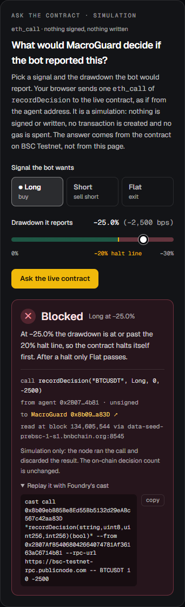

### Whole panel: desktop and phone

Verdicts, the what-if, the verified decision trail (each row opens BscScan), the halt line and the limits ("what this does not prove").

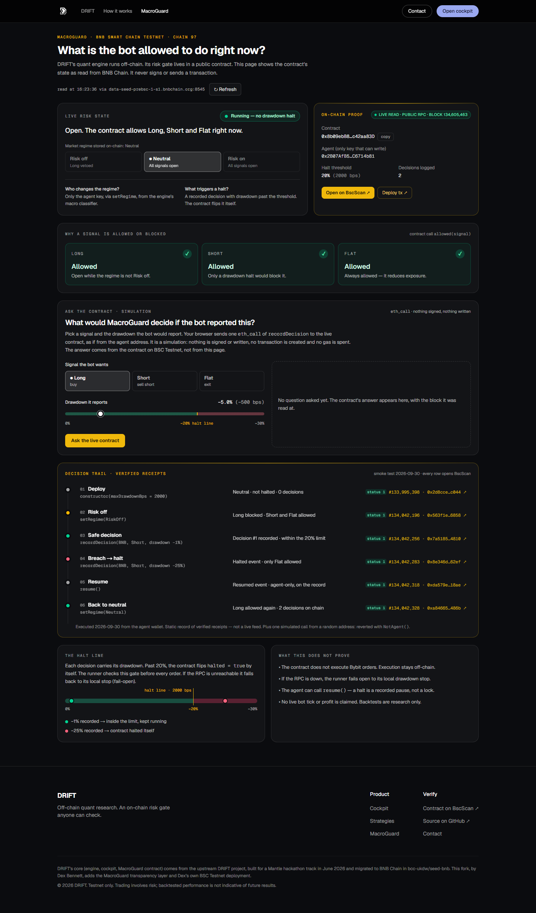

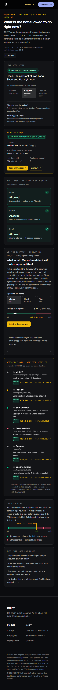

### When the chain cannot be read

With both public RPCs blocked, the panel says so, makes no live claim, and still shows the dated receipts.

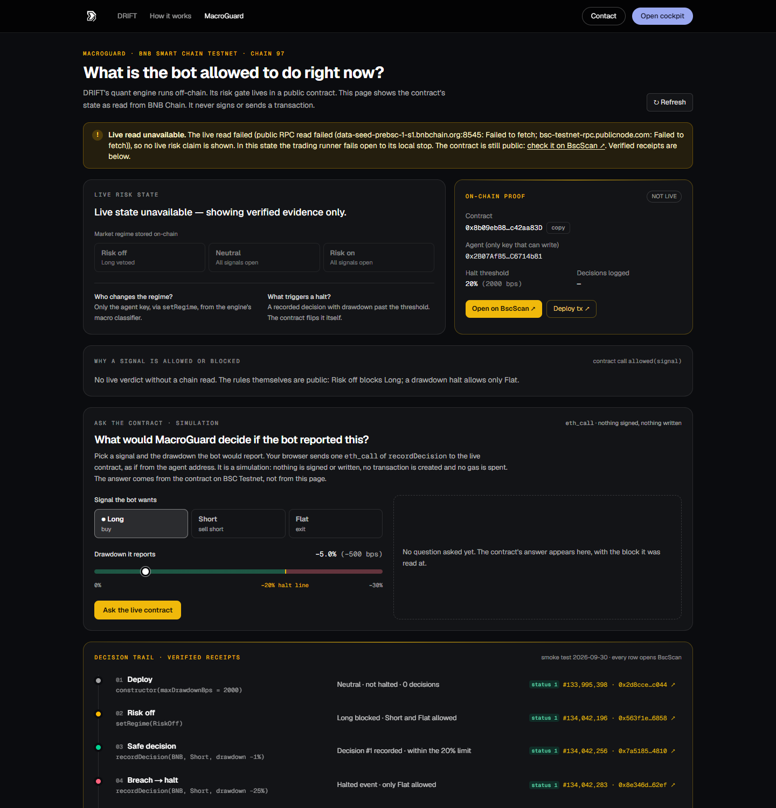

*Captures: 3 Oct 2026 from a local production build served on a non-localhost host name (the same mode as the hosted demo). Live values come from BSC Testnet at the block shown in each image.*

---

## Landing (`/`)

The hero says what DRIFT is in one line and routes to the live gate. The proof strip under it is static, dated evidence: the contract, the 20% halt line, the six receipts (deploy and smoke test) and the contract test count.

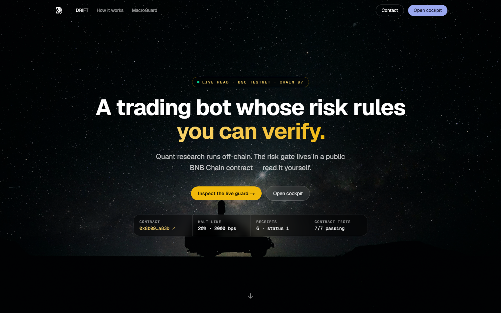

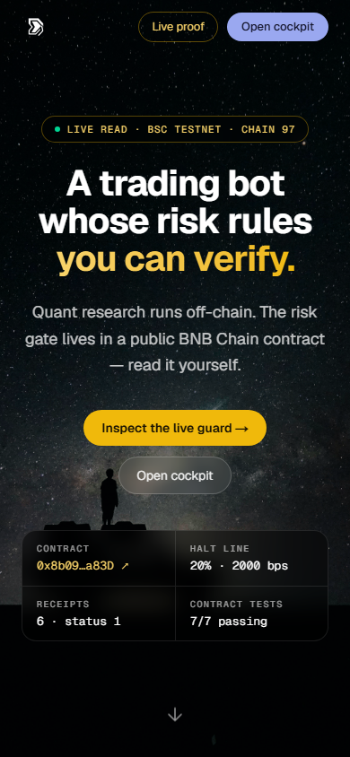

---

## The terminal (`./drift`)

Recorded on 3 Oct 2026 at 16.17 WIB (09.17 UTC) by running the terminal's own commands and exporting Rich's output, with no keys configured. Bybit's API is unreachable from the recording network, so every view below ran on the **Binance public-data fallback** and says so, with the candle range it used, in its last lines.

### Auto-Research: optimised on 70%, scored on the held-out 30%

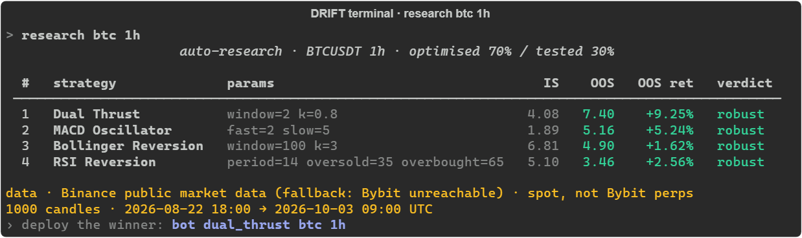

Historical simulation on 1,000 hourly BTCUSDT candles, 22 Aug 18.00 to 3 Oct 09.00 UTC (Binance spot). Sharpe is annualised from hourly bars (×√8760), so about six weeks of data gives large values; "robust" only means both slices passed the 0.5 threshold on this one window. Research, not a profit claim.

### Point-in-time backtest

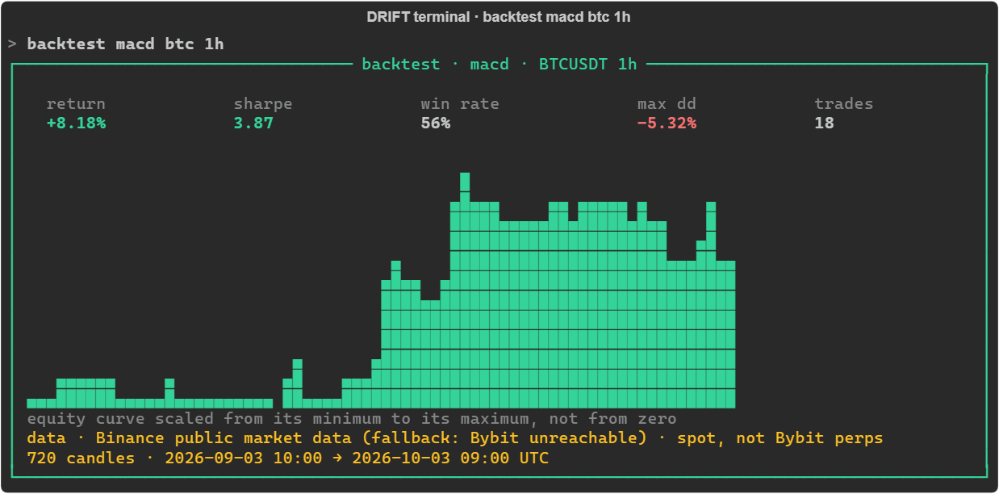

Historical simulation on 720 hourly BTCUSDT candles, 3 Sep 10.00 to 3 Oct 09.00 UTC (Binance spot); a position decided on one bar is earned on the next. The equity chart is scaled from its own minimum to its maximum, not from zero, so a gain of a few percent fills the frame. Research, not a profit claim; past results do not predict future ones.

### Markets

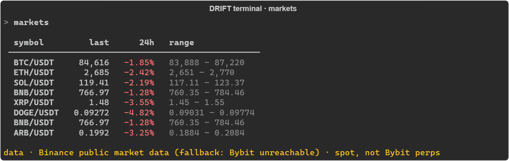

`BNB/USDT` appears twice: a known upstream issue (`BNBUSDT` is listed twice in `MARKET_SYMBOLS`), pinned by a strict `xfail` test and left unfixed in this fork.

### Not recorded

- `analyze <sym>` (the LLM analyst) needs an LLM API key; none was configured for the recording.
- `bot <strat> <sym>` needs Bybit testnet trading keys. **No live bot tick has been verified in this fork.**
- `chain` needs the engine configured with a contract address; the public panel above shows the same contract.

---

## The web cockpit (`apps/web`, run locally)

The cockpit needs the engine on the same machine. On the hosted demo its routes show one notice that links to `/macroguard` and to the README quick start, and they never call the engine.

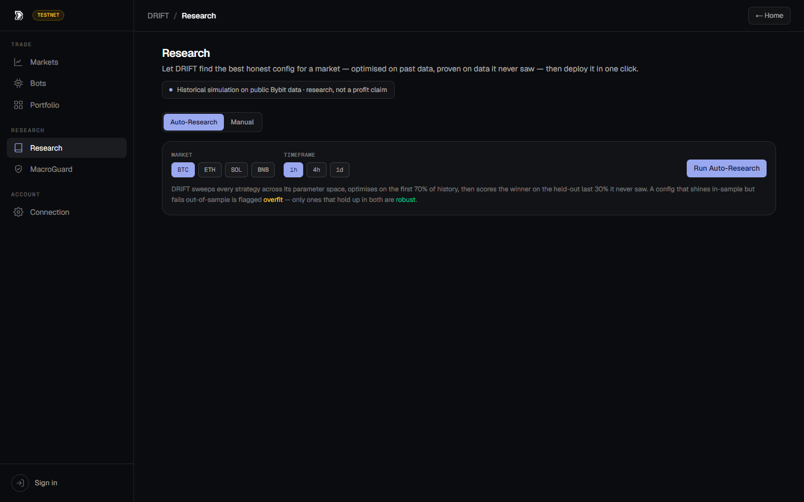

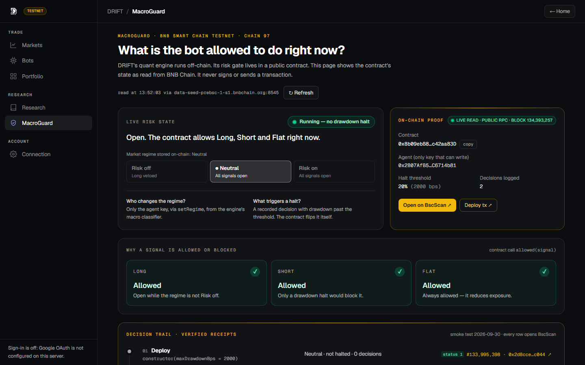

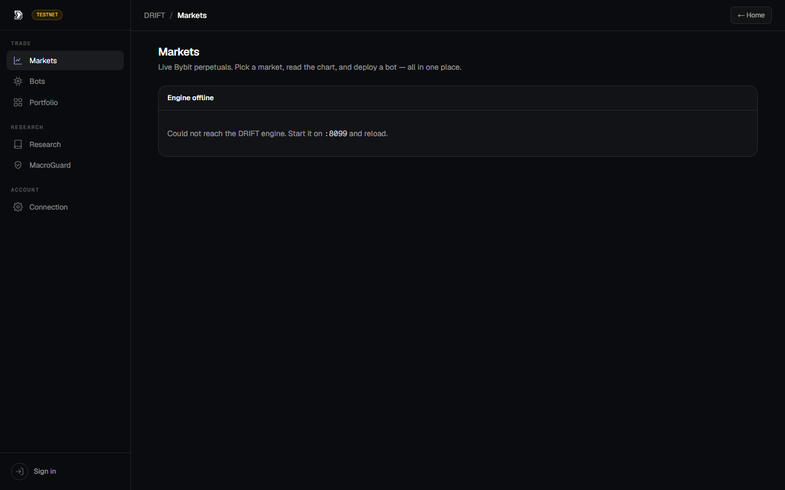

*These cockpit captures were taken with the engine stopped, so they show the empty and offline states. Live prices, candles, research results and bots in the browser have not been recorded for this showcase.*

---

## On-chain proof

Every transaction of the 30 Sep 2026 smoke test is linked, with block and gas, in the README's [proof table](README.md#proof-on-bnb-chain); the record is [`docs/deployment-dex.md`](docs/deployment-dex.md). Source verification: [Sourcify, exact match](https://repo.sourcify.dev/97/0x8b09ebB85Be8Ed55Bb5132d29eABc567c42aa83D). BscScan pages are not captured here because BscScan blocks automated capture; open the links instead.

---

See the <a href="./README.md">README</a> for the full docs, tests and threat model · Strategies ported from <a href="https://github.com/je-suis-tm/quant-trading">je-suis-tm/quant-trading</a>

